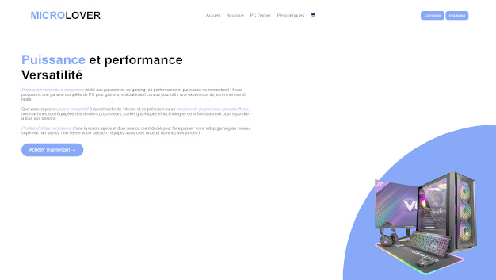
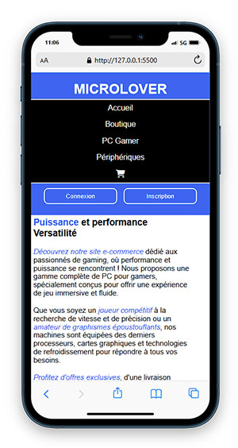
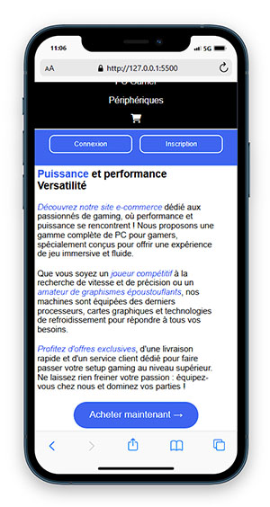

# Travaux dirigés : HTML - CSS
## Page d'accueil d'un site e-commerce en HTML et CSS (MICROLOVER)

:memo: Appuyez-vous sur les visuels fournis ci-après pour reproduire la page HTML.

## Objectifs :

-  :heavy_check_mark:	Reproduire le visuel du site en desktop first
-  :heavy_check_mark:	Réaliser une animation pour simuler le chargement de chargement d'écran 
-  :heavy_check_mark:	Ajouter des effets d'animation sur les boutons et l'image (voir la vidéo)
-  :heavy_check_mark:	Respecter les standards du Web (analyse Lighthouse)
-  :heavy_check_mark:	Have fun ! :smile:

:sparkles: Lien du projet : https://princecorg.github.io/MicroLover/

## Visuels de la page :

Voici les visuels des vues ordinateur et mobile/tablette (Point de rupture à 1024px)

| Vue Ordinateur  |
|-----------|
|  |

| Vue Mobile haut  | Mobile bas |
|-----------|-----------|
|  |  |

:rotating_light: Notez la disparition de l'image de l'ordinateur sur les versions mobile et tablette.

## Animation CSS :

Vidéo de présentation des animations CSS intégrées à la page

https://github.com/user-attachments/assets/25a76aab-2efc-496d-9e9e-c84eb64c9f90

:memo: L'animation du loader est libre, n"hésitez pas à utiliser des ressources accessibles ici :

- Animations CSS personnalisables : [Animista](https://animista.net/)
- Spinners, loaders et boutons : [CSSFX](https://cssfx.netlify.app/?ref=undesign)
- Loaders et Spinners : [CSS Loaders and Spinners](https://cssloaders.github.io/)

## Contraintes :

:rotating_light: Le code passera la validation W3C pour le HTML et le CSS. 

:rotating_light: Le code respectera la norme WCAG 2.0 AA. 

:rotating_light: Le code devra être disponible sur un repository public sur GitHub et hébergé sur GitHub Pages.  

## Have fun !

