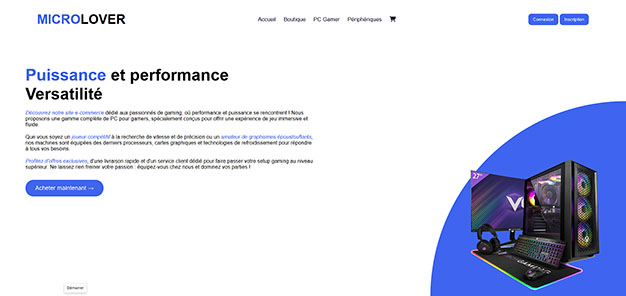

# Exercice de révison HTML - CSS
## Page d'accueil d'un site e-commerce en HTML et CSS
:memo: Appuyiez vous sur les visuels fournis ci-après pour reproduire la page HTML.
## Objectifs :
-  :heavy_check_mark:	Reproduire le visuel du site en desktop first
-  :heavy_check_mark:	Réaliser une animation pour simuler le chargement de chargement d'écran 
-  :heavy_check_mark:	Ajouter des effets d'animation sur les boutons et l'image
-  :heavy_check_mark:	Respecter les standards du Web (analyse Lighthouse)
-  :heavy_check_mark:	Have fun ! :smile:

:sparkles: Lien du projet : https://princecorg.github.io/MicroLover/

## Screenshots :
Voici les visuels des vues ordinateur et mobile/tablette (Point de rupture à 1024px)

| Vue Ordinateur  |
|-----------|
|  |

| Vue Mobile haut  | Mobile bas |
|-----------|-----------|
|  |  |

:rotating_light: Notez la disparition de l'image de l'ordinateur sur les versions mobile et tablette.

